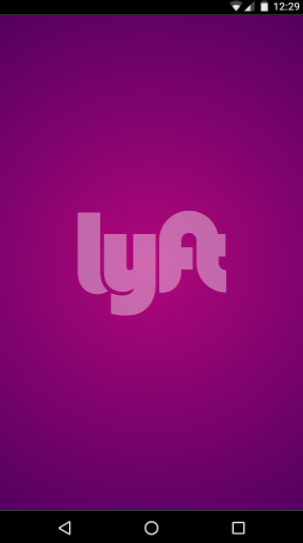
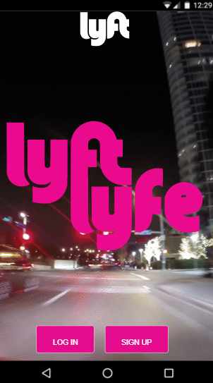
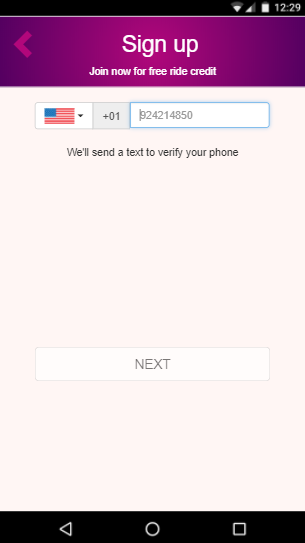
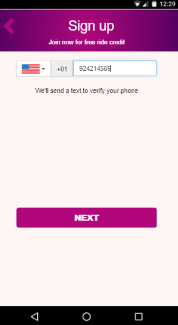
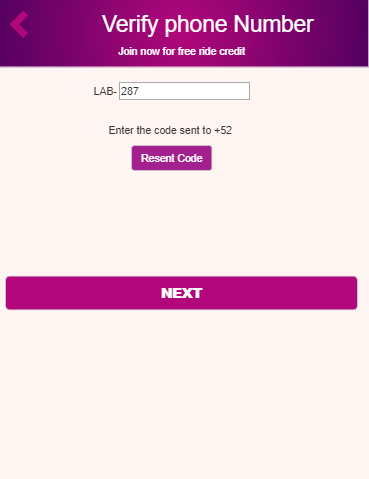
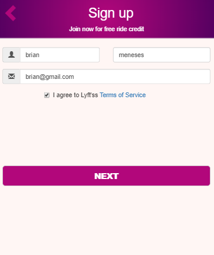

# L Y F T

It is a platform that allows you to register as a driver in Lyft through a verification code to provide transport service.

## Desarrollado para
[Laboratoria](http://laboratoria.la)

## Tools

* HTML
* CSS
* Framework bootstrap
* Jquery

## Flow of the application
1. Splash view: This view is available for 4 seconds.

 

2. Main view: This view has a button `sign up` that allows you to register to the platform.

 

3. Sign-up view: It allows you to register with a telephone number with a country selector.

 - When you select the country, the postal code is showed and you can write a phone number.

    

 - When you write your phone number, the "next" button is enabled to  go to the other view.

    

 - By clicking to the "next" button, the platform will give you a random code

    

4. Verify view: It allows you to enter the code generated previously but in case the client forgets, you can request another code with the resent button.

 

5. Form view: This view allows you to register your name, last name and email.

 

6. End view: It is the view where indicates that everything was successfully concluded.

 

## Bibliographical sources

* [expresiones regulares jquery](https://www.solvetic.com/tutoriales/article/1473-expresiones-regulares-con-jquery/)
