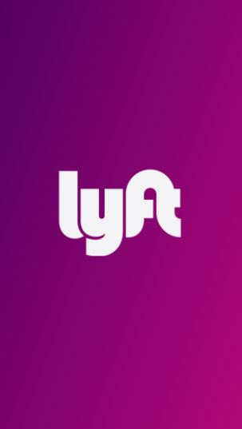
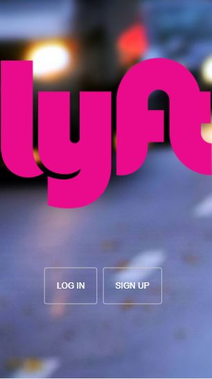
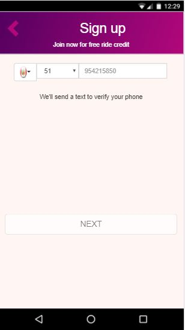
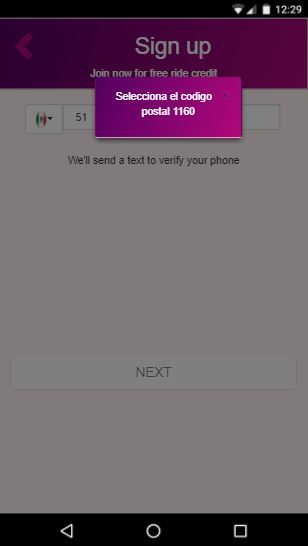
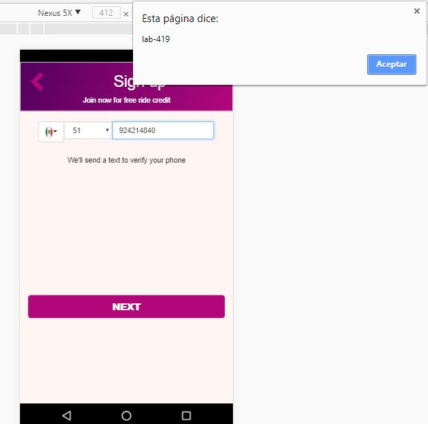
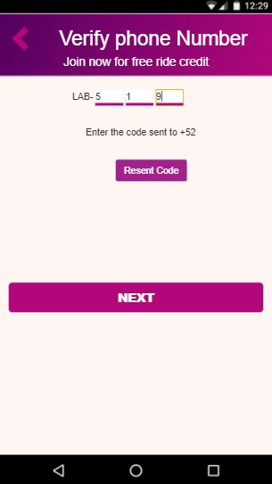
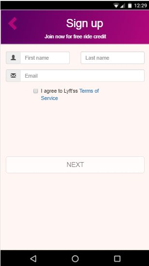
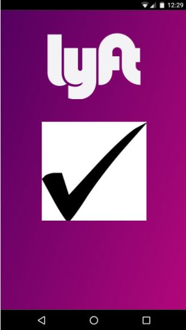

# Reto L Y F T

## Objetivo
Desarrollar una web-app que replique el sitio de Lyft

## Flujo de la aplicación
1. Vista splash: Esta vista estás disponible por 4 segundos

2. Vista principal:Esta vista tiene un botón que te permite inscribirte a la plataforma

3. Vista sign-up: Permite inscribirte con un número telefónico con un selector de paises

Asimismo consta de un selector para elegir el codigo postal del país.Para ello se adiciono un mensaje para guiar al cliente sobre el código postal.

Luego de que se introduzca el n° telefonico, el botón next se habilita y te brinda un codigo.

4. Vista verify: Te permite introducir el codigo generado anteriormente pero si en caso el cliente se olvida puede solicitar otro codigo con el botón resent.

5. Vista formul: Esta vista te permite registrar tus nombre, apellido y correo.

6. Vista-final: Es la vista donde indica que todo se concluyo exitosamente

